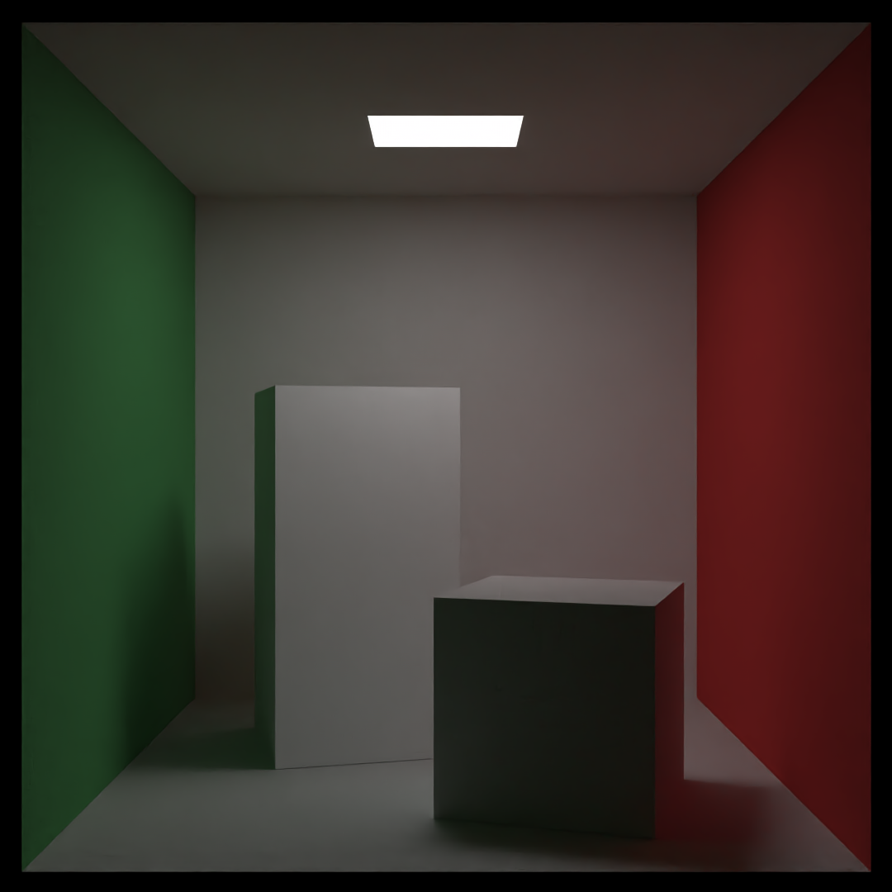
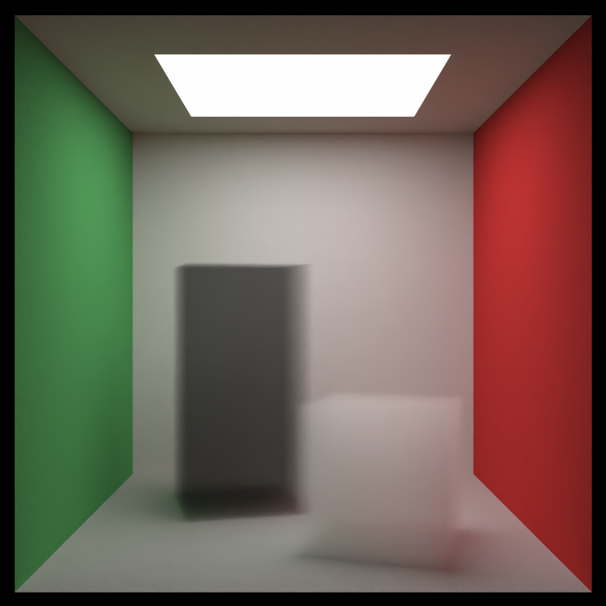
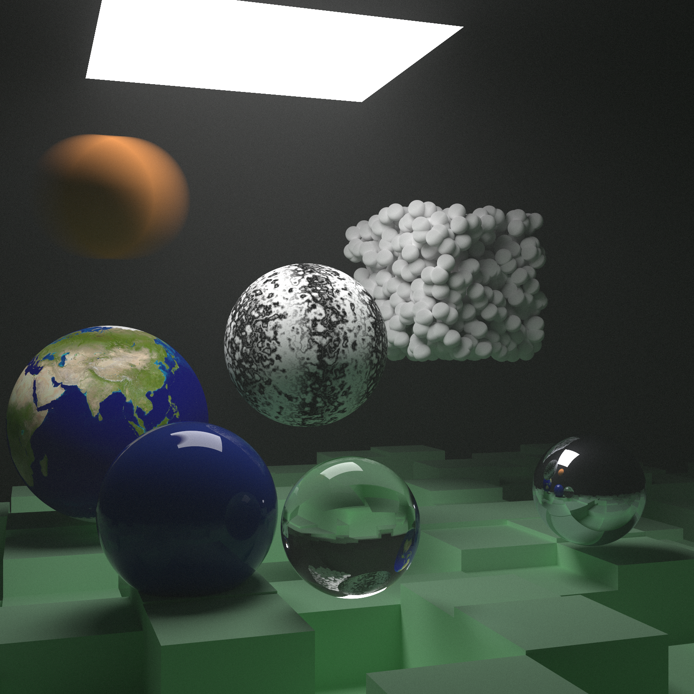
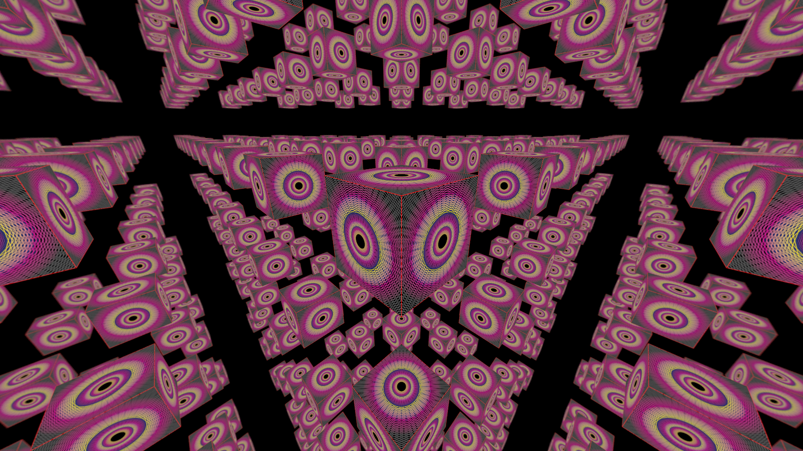

# Ray Tracer CUDA

A CUDA implementation of the Peter Shirley Ray Tracing Series (currently at _*The Next Week*_, will introduce importance sampling when I get time). This is by no way any guide on how to write good CUDA programs as my main aim of this project was to get familiar with the CUDA

## Samples

Here are some of the samples obtained after renders

### Cornell Box

| Cornell Box - Standard | Cornell Box - Volumetric |
|:----------------------:|:------------------------:|
|  |  |

### The Next Week Final Scene

### Infinity Room

There are only 2 cubes in the scene, a large cube encompassing a smaller cube. The large cube is an almost perfect metallic surface which leads to this interesting phenomenon of infinite reflections. The number of bounces were limited to 10 mainly for aesthetic reasons as more bounces makes it hard to decern the individual reflections. The small cube is textured using a plain image which is loaded on the host and then moved to the device

